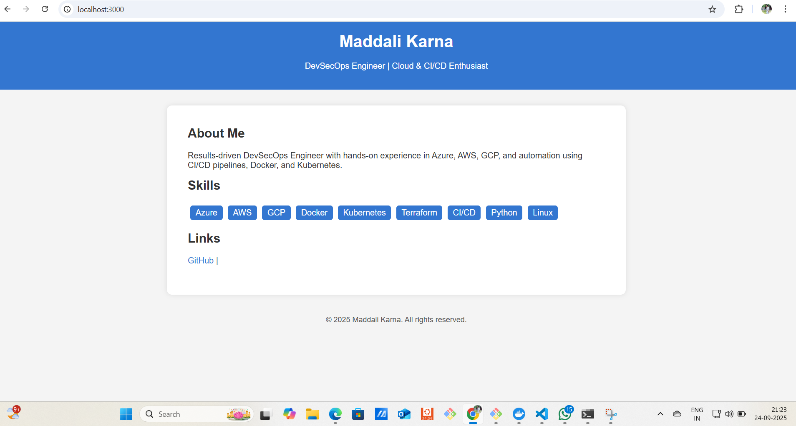
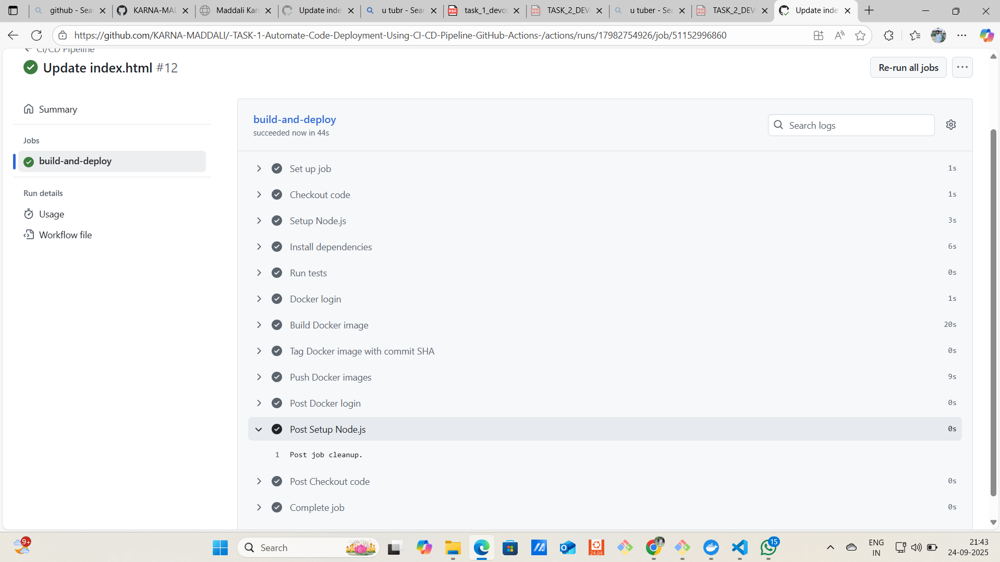

# Node.js CI/CD Pipeline with Docker and AWS Deployment

## Overview
This project demonstrates a **complete CI/CD pipeline** using **GitHub Actions** to automate the build, test, and deployment of a **Node.js web application** using **Docker**.  

The deployment is configured to run automatically on an **AWS EC2 instance**, so every push to the `main` branch updates the application in the cloud without manual intervention.

---

## Features
- **Node.js Web Application**: Sample web app running on port 3000.
- **CI/CD Automation**:
  - Checkout code from GitHub
  - Install dependencies
  - Run tests (placeholder currently)
  - Build Docker image
  - Push Docker image to DockerHub
  - Deploy automatically on AWS EC2 via SSH
- **Dockerized Application**: Ensures consistent environment and easy deployment.
- **Cloud Deployment**: App runs automatically on EC2 after code changes.

---

## Folder Structure
nodejs-demo-app/
│
├── .github/
│ └── workflows/
│ └── main.yml # CI/CD workflow
├── Dockerfile # Docker image build file
├── README.md # This file
├── package.json # Node.js project config
├── package-lock.json
├── server.js # Node.js app code
└── public/ # Optional static files

---

## How the CI/CD Pipeline Works

1. **Trigger**: The pipeline runs automatically on every push to the `main` branch.
2. **Steps**:
   - Checkout the code from GitHub.
   - Set up Node.js environment.
   - Install project dependencies.
   - Run tests (`npm test`).
   - Build a Docker image.
   - Push Docker image to DockerHub.
   - Connect to AWS EC2 via SSH and deploy the container:
     - Pull latest image
     - Stop old container (if any)
     - Run the new container
     - Verify it is running (`docker ps`)
3. **Access the App**: After deployment, open a browser and visit:


  access the web app: http://<EC2_PUBLIC_IP>:3000

---

## Screenshots
 

---

## Secrets Used in GitHub Actions
- `DOCKERHUB_USERNAME` – DockerHub username  
- `DOCKERHUB_TOKEN` – DockerHub access token  
- `EC2_HOST` – Public IP/DNS of AWS EC2 instance  
- `EC2_USER` – SSH username (usually `ubuntu`)  
- `EC2_SSH_KEY` – Private SSH key to access EC2

> Secrets are securely stored in GitHub and never exposed in the workflow file.

---

## Key Learnings
- Understanding CI/CD principles and automation.  
- Building, tagging, and pushing Docker images.  
- Automatic deployment to AWS cloud via SSH.  
- Using GitHub Actions with secrets and self-hosted or remote runners.  
- Managing Docker containers on a cloud server.

  ## Screenshots
 

---

## How to Run Locally (Optional)
1. Install Docker on local machine or WSL.  
2. Clone the repo:

```bash
git clone https://github.com/<YOUR_USERNAME>/nodejs-demo-app.git
cd nodejs-demo-app

Build Docker image:

docker build -t nodejs-demo-app:latest .


Run container:

docker run -d -p 3000:3000 --name nodejs-demo-app nodejs-demo-app:latest


Open browser at http://localhost:3000 to see the app.

Author

Maddali Karna
DevOps / DevSecOps Engineer
GitHub: Karna-Maddali

Email: maddalikarna9@gmail.com


